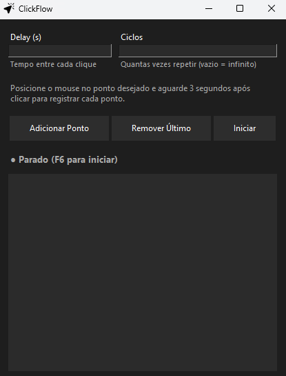

# 🖱️ ClickFlow
> Auto Clicker leve, rápido e open-source para Windows


---

## 🚀 Download

👉 Baixe a versão mais recente:

<p align="center">
  <a href="https://github.com/PedroHMDosSantos/ClickFlow/releases/download/v.4.0.0/ClickFlow-Setup-v4.0.0.exe">
    
  </a>
</p>

---

## 🚀 Sobre o projeto

O **ClickFlow** é um auto clicker com interface gráfica feito em Python (Tkinter).  
Ele permite registrar múltiplos pontos na tela e automatizar cliques com controle de delay, ciclos e hotkeys.

---

## ⚙️ Funcionalidades

- 🎯 Adicionar múltiplos pontos de clique
- ⏱️ Delay configurável entre cliques
- 🔁 Ciclos ou modo infinito
- 🎮 Atalho global (F6) para iniciar/parar
- 📊 Logs em tempo real
- 🖥️ Interface leve e simples

---

## 🖥️ Interface

Projeto focado em simplicidade e usabilidade, sem dependências pesadas.



---

## 📦 Versions

- v1.0 → Base funcional  
- v2.0 → UI melhorada  
- v3.0 → Hotkeys e estabilidade  
- v4.0 → Release final  

---

## 📥 Instalação

```bash
git clone https://github.com/PedroHMDosSantos/ClickFlow.git
cd ClickFlow
pip install -r requirements.txt
python main.py